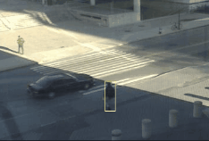

# C++ KCF Tracker



This package includes a C++ class with several tracking methods based on the Kernelized Correlation Filter (KCF) [1, 2].   
It also includes an executable to interface with the VOT benchmark.

[1] J. F. Henriques, R. Caseiro, P. Martins, J. Batista,   
"High-Speed Tracking with Kernelized Correlation Filters", TPAMI 2015.

[2] J. F. Henriques, R. Caseiro, P. Martins, J. Batista,   
"Exploiting the Circulant Structure of Tracking-by-detection with Kernels", ECCV 2012.


Authors: Joao Faro, Christian Bailer, Joao F. Henriques   
Contacts: joaopfaro@gmail.com, Christian.Bailer@dfki.de, henriques@isr.uc.pt   
Institute of Systems and Robotics - University of Coimbra / Department of Augmented Vision DFKI   

## Algorithms (in this folder)

"KCFC++", command: ./KCF   
Description: KCF on HOG features, ported to C++ OpenCV. The original Matlab tracker placed 3rd in VOT 2014.

"KCFLabC++", command: ./KCF lab   
Description: KCF on HOG and Lab features, ported to C++ OpenCV. The Lab features are computed by quantizing CIE-Lab colors into 15 centroids, obtained from natural images by k-means.   

The CSK tracker [2] is also implemented as a bonus, simply by using raw grayscale as features (the filter becomes single-channel).   

## Compilation
There are no external dependencies other than OpenCV 3.0.0+. Tested on freshly installed Ubuntu 14.04 / Ubuntu 16.04.   

```bash
$ mkdir build
$ cd build
$ cmake -DCMAKE_BUILD_TYPE=Release ..
$ make
```  

## Running instructions

The frame images are stored in the directory `frames`. All frames are named by its index (started from 1). The configurations are stored in the file `config.txt`:

```
120,205,151,17,50
```

The first number is the total amount of frames. The last four numbers indicates the initial bounding box parameters of the first frame.

**Notes:** If your frames are named like "0001.jpg", "02.jpg" or "0100.jpg" (e.g. datasets from [Visual Tracker Benchmark][VTB]), you should run the script below to normalize them to "1.jpg", "2.jpg" and "100.jpg", respectively:

```
$ python norm.py
```

Suppose you've finished the procudures above. You could run the KCF tracker with the commands below:

```bash
$ cd build
$ ./KCF show
```

The bounding box parameters of each frame will be stored to a file named `result.txt`. 

***

### Original instrucions:

The runtracker.cpp is prepared to be used with the VOT toolkit. The executable "KCF" should be called as:   

./KCF [OPTION_1] [OPTION_2] [...]

Options available:   

gray - Use raw gray level features as in [1].   
hog - Use HOG features as in [2].   
lab - Use Lab colorspace features. This option will also enable HOG features by default.   
singlescale - Performs single-scale detection, using a variable-size window.   
fixed_window - Keep the window size fixed when in single-scale mode (multi-scale always used a fixed window).    

To include it in your project, without the VOT toolkit you just need to:
	
	// Create the KCFTracker object with one of the available options
	KCFTracker tracker(HOG, FIXEDWINDOW, MULTISCALE, LAB);

	// Give the first frame and the position of the object to the tracker
	tracker.init( Rect(xMin, yMin, width, height), frame );

	// Get the position of the object for the new frame
	result = tracker.update(frame);

[VTB]: http://cvlab.hanyang.ac.kr/tracker_benchmark/datasets.html